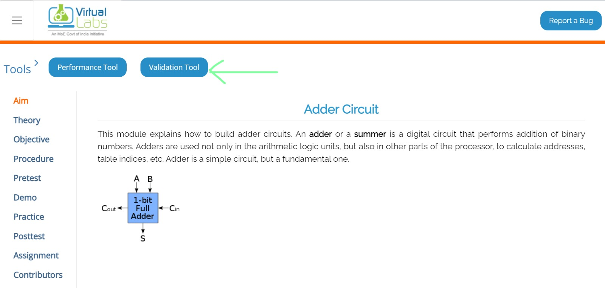
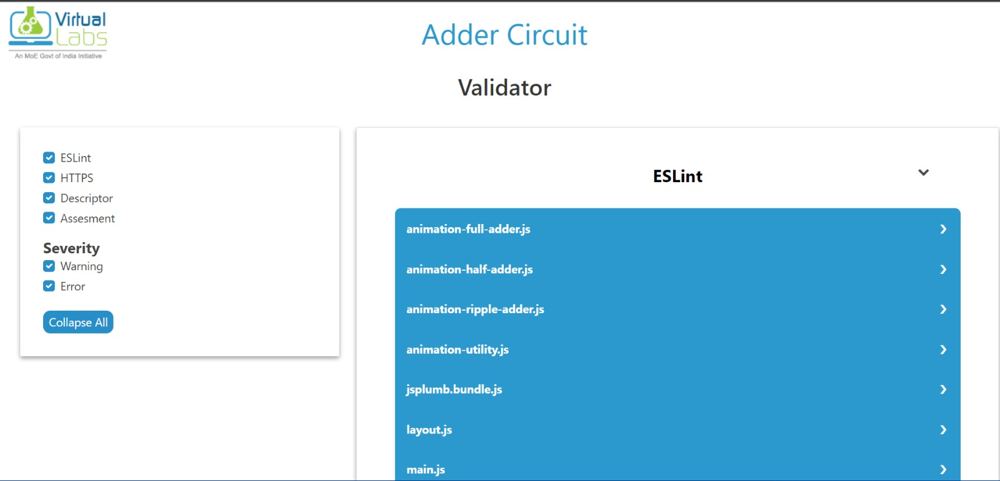

# Content Validation
---
title: "Content Validation"
summary: "Tools for code and content validation"
audience: "Experiment Developer"
date: 2023-05-11T13:49:21.348Z
tags: []
phase: "Ext Phase 3"
author: ["Shreyash Jain","Aditya Malhotra"] 
---

## Introduction
There is a need for a tool that can validate the code and content of the experiment. This tool will help in catching errors early and since these tools are available directly to the developers they can validate the files, thus it saves time. We have added 4 validation tools, and a dedicated UI webpage to view the logs. The UI is user-friendly which allows the developer to debug easily. These tools are:
1. Eslint
This will ensure consistency in the code, will point out bugs and will raise warnings when the coding standards are not followed.
2. Validate Experiment Descriptor
The experiment descriptor is the primary file that contains information on how the build directory is going to be created, thus validating it is of high importance.
3. Validate code-assessment.json
The `code-assessment.json` file contains the Code assessment problems along with their inputs and
expected outputs. The component needs the json to be in prescribed format for the data to be parsed. Thus validating it becomes significant.
4. Validating Assessment Files
In an experiment, a developer wants to create quizzes. Virtual labs have a standard template for rendering quizzes, thus a developer needs to write a JSON file which will be converted to a quiz. These JSON files are validated via this tool
5. Checking for HTTP links
These tools check whether the build directory contains any HTTP links or not.
The HTTP links bring security concerns and hosting issues.

## How to use
After the experiment has been build and deployed there will be button on the top named `validation-tool` (as shown in the figure below). On clicking it, a new page will open that contains all the logs of the validation tools.  

The page will look like this:  

On the left side, there will be a list of all the validation tools. You can select multiple tools, there is an option to choose severity as well. On the right side the logs will be displayed, you will get the file name, to see the details of the error click on the file name. The details will be displayed below the file name. 

## How to validate
Check the build logs, if there are any errors in the build logs then the validation tool will not work. If there are no errors in the build logs then you can use the validation tool.

## Important Points
1. The validation tool will only work if there are no major errors in the build process. You can check the build logs to see if there are any errors or not.
2. The validation tool can be viewed in the deployed experiment.
