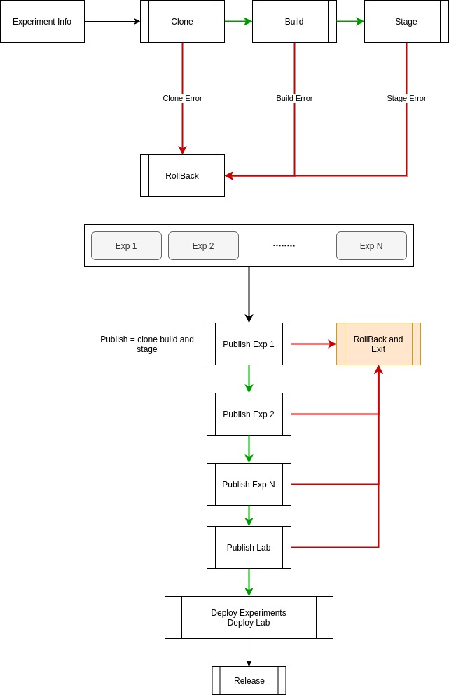

## ***Lab Build Process***

<!-- # Table of Contents

1.  [Introduction](#orgc8ae9bc)
2.  [Process](#org42fecff)
    1.  [Generate Pages](#org457b7ff)
        1.  [Assumptions](#org101d806)
        2.  [Dependencies](#org3aec332)
        3.  [Generating Components](#orgdcd3f01)
        4.  [Generate Lab](#orgfc8d60a)
    2.  [Build and Stage Experiments](#orgf4cdbd4)
    3.  [Stage Lab](#org090883a)
    4.  [Deploy](#org7da2051)
    5.  [Release Management](#orgf35544a)
        1.  [Version scheme](#org425b79a)
3.  [Reporting](#org468215d)
4.  [Descriptor Validation](#org8e4962e) -->

# Introduction

This document describes the lab build process.

# Process

## Generate Pages

### Assumptions

-   There exists a git repository for the lab.
-   The lab repository is available on the machine that runs this
    script.
-   The lab repository has a remote (usually on
    [https://github.com/virtual-labs/](https://github.com/virtual-labs/))
-   The lab repository has a `master` branch.
-   There exists a `lab-descriptor.json` in the lab repository.
-   Experiment repositories (and tags) exist and follow the provided
    experiment [template](https://github.com/virtual-labs/ph3-exp-template/).

### Dependencies

-   **Template:** The template html file that defines the common
    skeleton for all pages.
-   **Config:** This contains information about which pages are
    generated using which templates.
-   **Lab Descriptor:** This is a json document that contains all the
    lab related data.  This should be present in
    the lab repository, on the master branch.
-   **Page Templates:** Each page in the lab is generated using the
    top level skeleton and a page specific
    template.  The data for the page specific
    template comes from the lab descriptor.  All
    the page templates are placed in a directory
    called `page-templates`.

### Generating Components

The components are generated using templates.  Templates are found
in the [page-templates](../lab_build/page-templates/) directory.

The `page-templates` directory contains [handlebarsjs](https://handlebarsjs.com/) templates.
Each of these templates is one of two types:

-   **Page Specific Template:** Page specific templates are defined
    for components that are required in a single page.
-   **Common Template:** Common Templates are used to generate
    components like headers, footers etc. that are placed in each
    page.

1.  Difference Between IIITH and Other Lab pages

    The IIITH lab pages are similar to all other lab pages, except
    for the List of Experiments Page.  The list of experiments page
    has different template for the two types of experiments.
    
    -   **Template for IIITH Labs:** nested-list-of-experiments-ctnt.handlebars
    -   **Template for Other Labs:** list-of-experiments-ctnt.handlebars
    
    As the templates are different, the data also comes from
    different fields in the lab-descriptor.
    
    -   **IIITH Lab List of Experiments Field:** `experiments`
    -   **Other Lab List of Experiments Field:** `nested-experiments`
    
    Only one of these fields should be present in a lab-descriptor.
    
    **NOTE**: If both fields are present, the lab pages will not be
    generated.

### Generate Lab

Once the pages are generated (generated pages are present in
`page-components`) the lab is generated using the following:

-   **Page Components:** Page Components are the html pages generated
    using the data and templates.

-   **assets:** the css, js, images and fonts are taken from
    `templates/assets` directory.

## Build and Stage Experiments

After the lab pages are built, the experiments need to built and
staged.

## Stage Lab

If the build and staging process of experiments is successful, we
move on to the process of staging the lab.

Here we basically just copy the contents of the `build` directory
from the labpath to the staging location, which is a directory on
the server.

## Deploy

If the staging of experiments and lab sources succeeds the last
step is to place the lab sources and the experiments to their final
location on the server.

**NOTE**: We assume that is process is not prone to any known errors.

## Release Management

After each successful lab generation and deployment process, the
lab sources are pushed to its repository along with the timestamp
in its commit message.

A new release of the sources is made by incrementing the previous
release number.  The numbering scheme follows semantic versioning.
The type of release determines the version number.

### Version scheme

Every release follows the scheme : `v<X>.<Y>.<Z>`. Where X, Y, and
Z are non-negative integers.

Types of releases:

-   **Major:** X is incremented and Y, Z become 0.
-   **Minor:** X stays the same.  Y is incremented and Z becomes 0.
-   **Patch:** X and Y remain the same.  Z is incremented.

# Reporting

The timestamp, verion number and status (success or failure) of the run is updated to a [google sheet](https://docs.google.com/spreadsheets/d/1Z-acT5GKrna_JyHanxq3mXKocRPUb1KPL8vY7mKa5KA/edit#gid=0).

# Descriptor Validation

The lab descriptor is validated using a [schema](../validation/schemas/labDescSchema.json).  If anything is
invalid in the lab descriptor, the error is displayed and process aborts.
